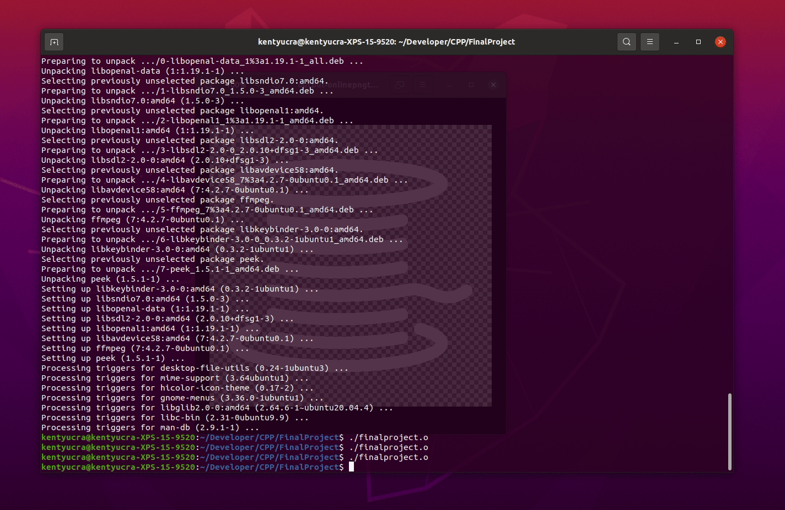
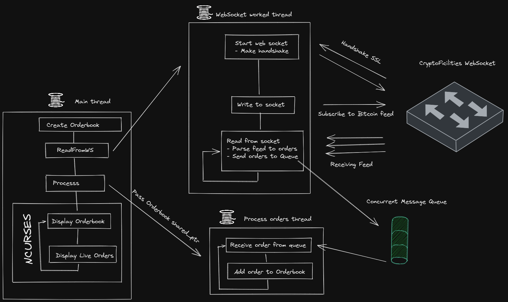

# CppND-Bitcoin-Orderbook

For the final project of the C++ Nano Degree I want to create a orderbook which is a essential part of any trading system, I was able to use all the concept learned on the degree.



## Dependency for Running Locally

- g++:

```bash
linux-ubuntu-20.04$ g++ --version
g++ (Ubuntu 9.4.0-1ubuntu1~20.04.1) 9.4.0
```

- make:

```bash
linux-ubuntu-20.04$ make --version
GNU Make 4.2.1
```

- Boost:

```bash
linux-ubuntu-20.04$ sudo apt install libboost-all-dev
linux-ubuntu-20.04$ dpkg -s libboost-dev | grep "Version"
Boost version (currently 1.71).
```

## Diagram of system



## Basic Build instructions

1. Lone this repo
2. Compile `make`
3. Run it: `./finalproject
